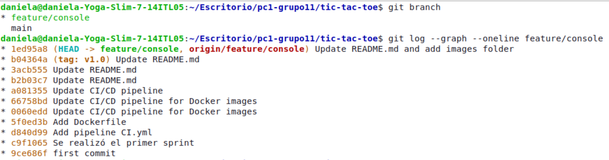
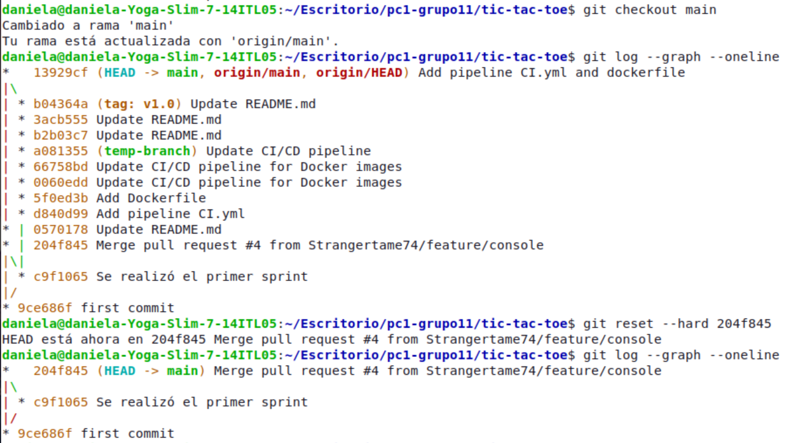
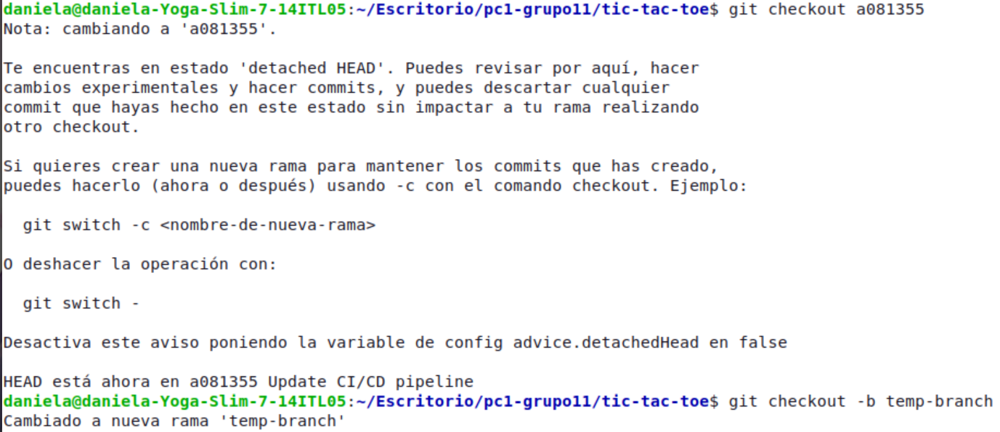
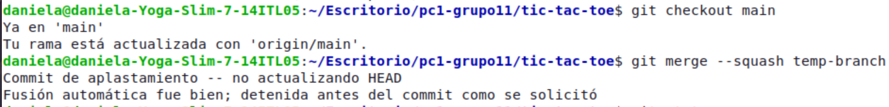
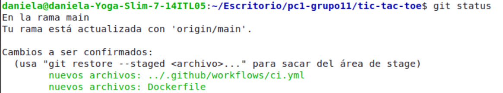
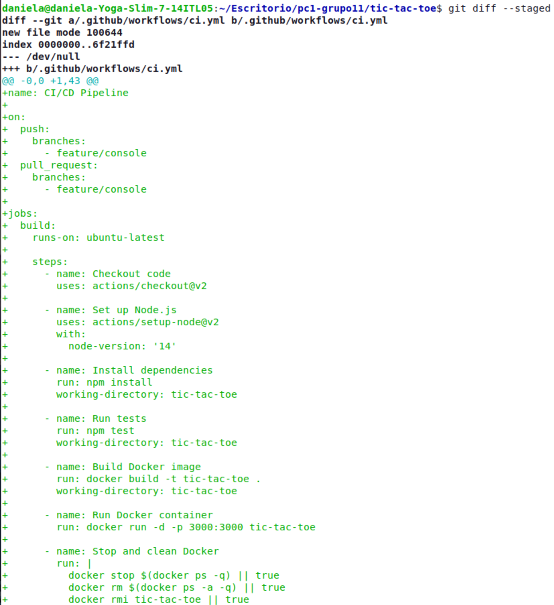
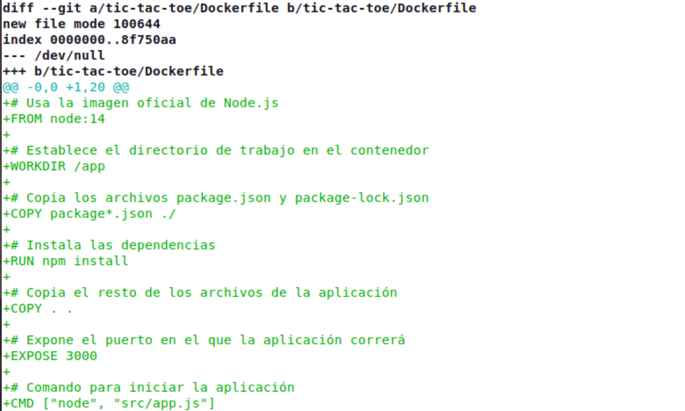
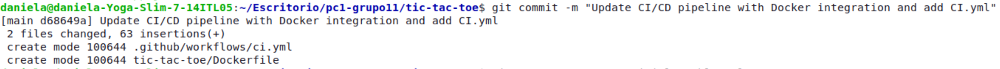
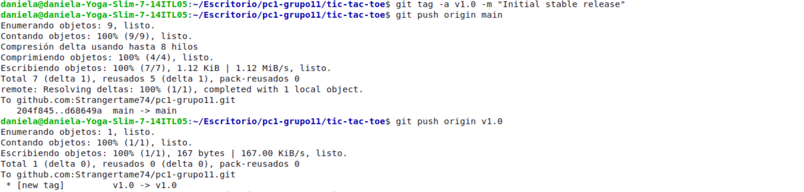

# PC1-Grupo11

## Tic-Tac-Toe en línea

### Objetivos
- Implementar una API REST para gestionar las partidas y las puntuaciones.
- Crear un cliente de consola para que los jugadores participen en partidas en línea.
- Implementar DevSecOps: Usar una herramienta de análisis de seguridad (por ejemplo, OWASP Dependency-Check para JavaScript) y configurar GitHub Actions para CI/CD.
- Contenerizar la aplicación y la base de datos con Docker y gestionar con Docker Compose.
- Configurar Prometheus y Grafana para monitorizar las métricas del juego, como la cantidad de partidas activas.

## 1. Implementación de la lógica de Tic-Tac-Toe en la API REST

- **Tarea:** Implementar la lógica del juego Tic-Tac-Toe (tres en raya) a través de una API REST. Los jugadores deben poder hacer sus movimientos y la API debe determinar el resultado de cada partida (ganador, empate, etc.).
- **Objetivo:** Comprender cómo gestionar la lógica del juego y el estado de las partidas en una API REST.
- **Enfoque del ejercicio:** Usar Flask o FastAPI (Python), Express (JavaScript) o Spring Boot (Java)
para implementar la lógica del juego, el registro de movimientos y la evaluación de resultados.

### Documentación de la API REST para Tic-Tac-Toe

Para realizar la primera parte del proyecto, se decidió crear la rama `feature/console`, donde se desarrolló la lógica del juego y se añadieron algunos tests. Además, se incluyó un pipeline básico y un Dockerfile minimalista con el fin de probar la automatización en GitHub Actions y la construcción de la imagen. Más adelante, estos componentes se adaptarán para cumplir con los requisitos completos del proyecto. Finalmente, el contenido de la rama `feature/console` se fusionó en la rama `main` utilizando un merge-squash. 

A continuación se detalla lo que se incluyo en esta primera parte:

**Endpoints implementados**

1. **Crear una nueva partida**
   - **Método**: `POST`
   - **Ruta**: `/games`
   - **Descripción**: Este endpoint crea una nueva partida de en el juego con un tablero vacío y establece al jugador "X" como el primero por defecto.
   - Debería aparecer el mensaje de Partida Creada junto con eso:
    ```json
     {
       "id": 1,
       "board": [null, null, null, null, null, null, null, null, null],
       "currentPlayer": "X",
       "status": "En progreso",
       "winner": null
     }
     ```
     
2. **Obtener el estado de una partida**
   - **Método**: `GET`
   - **Ruta**: `/games/:id`
   - **Descripción**: Devuelve el estado actual de una partida específica, incluyendo el tablero, el jugador actual, el estado de la partida y el ganador, si aplica.
   - Después de que el jugador X hizoz el primer movimiento el jugador O el segundo movimiento nos debería devolver algo así:
     ```json
     {
       "id": 1,
       "board": ["X", null, null, null, "O", null, null, null, null],
       "currentPlayer": "X",
       "status": "En progreso",
       "winner": null
     }
     ```

3. **Hacer un movimiento**
   - **Método**: `PATCH`
   - **Ruta**: `/games/:id`
   - **Descripción**:  Este endpoint actualiza el tablero de la partida con un único movimiento hecho por el jugador actual. No es necesario pasar el estado completo del tablero en cada turno, solo la posición del movimiento y el jugador que lo realizó. El endpoint se encarga de verificar si hay un ganador o si el juego ha terminado en empate, y actualiza el estado del juego.
   
   - Por ejemplo, si el jugador "X" quiere hacer un movimiento en la posición 2:
     ```json
     {
       "playerId": "X",
       "position": 2
     }
     ```
   - Nos debería de devolver algo así:
     ```json
     {
       "game": {
         "id": 1,
         "board": ["X", "O", "X", null, "O", null, null, null, null],
         "currentPlayer": "O",
         "status": "En progreso",
         "winner": null
       }
     }
     ```

4. **Obtener todas las partidas**
   - **Método**: `GET`
   - **Ruta**: `/games`
   - **Descripción**: Devuelve una lista de todas las partidas en curso con sus respectivos estados.
   - vamos a listar todas las partidas que creamos por ejemplo:
     ```json
     [
       {
         "id": 1,
         "board": ["X", "O", "X", null, "O", null, null, null, null],
         "currentPlayer": "O",
         "status": "En progreso",
         "winner": null
       },
       {
         "id": 2,
         "board": [null, null, null, null, null, null, null, null, null],
         "currentPlayer": "X",
         "status": "En progreso",
         "winner": null
       }
     ]
     ```
---

#### **Lógica del Juego**

El juego funciona de la siguiente manera:
- Primero se inicia la partida crerandose una nueva y se alista para el primer movimiento del jugador iterando de jugador en cada jugada, es decir el juego es capaz de identificar el turno del jugador.
- La API maneja un tablero de 3x3 representado por un array de 9 posiciones (índices del 0 al 8). Si el jugador ingresa un número inválido se le mostrará un mensaje de advertencia.
- El jugador que realiza un movimiento actualiza el array en la posición correspondiente, y después de cada movimiento, la API verifica si se ha formado alguna de las combinaciones ganadoras.
- Si se detecta una combinación ganadora, la partida se marca como **finalizada** y se declara un ganador.
- Si el tablero se llena sin un ganador, la partida se declara como **empate**.

#### **Puntajes**
- Los puntajes de los jugadores (`X` y `O`) se almacenan en un objeto llamado `scores`, que se incrementa cada vez que un jugador gana una partida.

#### **Servidor**
El servidor se ejecuta en el puerto 3000 por defecto.

### Instrucciones para ejecutar el proyecto

Sigue los pasos para ejecutar el proyecto desde tu máquina local.

#### **Clonar el Repositorio**
Primero clona el repositorio en tu máquina local usando el siguiente comando:

```bash
git clone https://github.com/Strangertame74/pc1-grupo11.git
cd tic-tac-toe
```

#### **Cambiar a la Rama `feature/console`**
El desarrollo de la primera versión del juego se encuentra en la rama `feature/console`. Cambia a esta rama con:

```bash
git checkout feature/console
```

#### **Instalar las Dependencias**
Asegúrate de tener **Node.js** instalado en tu máquina. Luego, instala todas las dependencias necesarias del proyecto con el siguiente comando:

```bash
npm install
```

#### **Ejecutar la Aplicación**
Para correr la aplicación, necesitarás abrir **dos terminales**: una para el servidor y otra para el cliente de consola.

- En la primera terminal, ejecuta el servidor (API REST):

```bash
node src/app.js
```

- En la segunda terminal, ejecuta el cliente de consola para interactuar con la API:

```bash
node src/client.js
```


### Instrucciones para ejecutar las pruebas
Sigue estos pasos para ejecutar las pruebas automatizadas que validan las funcionalidades de la API.

Usamos **Jest** y **Supertest** para realizar las pruebas unitarias y funcionales de la API. Puedes ejecutar todas las pruebas con el siguiente comando:

```bash
npm test
```

Esto correrá las pruebas que verifican:

- La creación de partidas
- La obtención del estado de una partida
- La actualización de una partida con movimientos válidos e inválidos 
- La detección de un ganador o empate.
- El manejo de errores, como partidas no encontradas o movimientos inválidos.

#### Resultados de las pruebas

Se realizaron diversas tests para garantizar que el juego funcione correctamente. Para ello se creo una carpeta `tests` donde se incluyo el archivo `app.test.js` y ahí se alamacenaron las pruebas. Se hiciero pruebas para la creación de partidas, la actualización del estado del juego con movimientos válidos e inválidos, así como la detección de un ganador o empate. Y podemos observar en la imagen que pasaron satisfactoriamente.


---

#### Proceso del uso de Git Squash

Como mencioné anteriormente esta primera parte se realizó en la rama `feature/console`, pero para realizar el uso de git squash, decidí crear otra rama llamada `temp-branch` dado que ya había docuementado la rama `feature/console` y no quería que se mezcle eso con la de la rama `main`. Por ello decidí crear a partir del commit anterior de empezar la documentación la rama `temp-branch`.

Historial del `feature/console` antes del merge 



Esto paso cuando lo fusione sin el squash efectivamente el historial del `main`no estaba limpio por lo cual decido deshacer ese cambio usando `git reset --hard <commit>`



Aquí decido crear la rama `temp-branch` desde el commit donde todavía no documentaba nada



Una vez creada esa rama, realicé:
```bash
git checkout main
git merge --squash temp-branch
```



Como vemos con ese comando no se hace el commit automáticamente sino que lo fusiona, revisa el conflicto y uno mismo debe de agregar los cambios y el commit para finalizar el merge.







Por último agregué el commit y empujé los cambios localmente. También le agregué una etiqueta para diferenciarlo con las próximas versiones.





Y sí echamos un vistazo al nuevo historial del `main` nos quedó así:


### Conclusión de la primera parte
Esta API ofrece la funcionalidad básica para jugar Tic-Tac-Toe a través de solicitudes HTTP, con la capacidad de manejar múltiples partidas simultáneamente, actualizar el tablero con cada movimiento, y determinar ganadores o empates.En este punto no se tiene implementada una base de datos que almacene la informacion de las partidas. Por lo que nosotros solo podemos ver esa información mientras el servidor esté corriendo. Quiero añadir que también se creó la clase consola que lo que nos permite es interactuar directamente con el juego en lugar de solo enviar las solicitudes en ese formato. Se hicieron tests para cada fucnionalidad que se implementó hasta este momento y se pasaron las pruebas éxitosamente.
