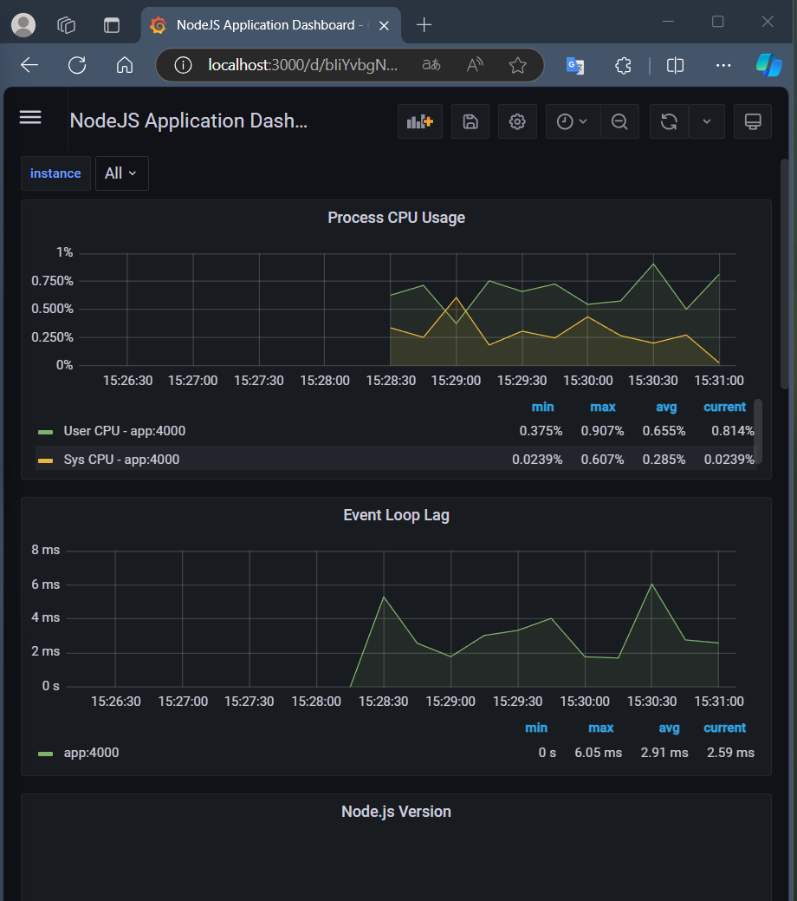

# pc1-grupo11 ~ branch

## new-feature/observability
Rama creada con la finalidad de agregar lass características de observabilidad con `Prometheus` y `Grafana`

## Prometheus
Añadimos el servicio prometheus en el archivo `docker-compose-yml` y el endpoint `/metrics` 
para recepcionar las métricas

## Grafana
Obtuvimos un dashboard de ``GrafanaLabs`` y lo conectamos a las métricas que admite

## Observaciones
Se presentó un error en el workflow. Será resuelto más adelante

## Resultados

