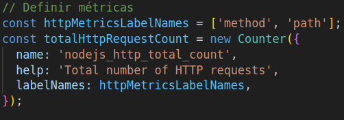

# pc1-grupo11 ~ branch

## feature/configurar-prometheus

## totalHttpRequestDuration
Este bloque de código define una métrica de tipo Counter que es utilizada 
para contar el total de solicitudes HTTP que maneja la aplicación

La métrica totalHttpRequestCount se incrementa cada vez que se recibe una 
solicitud HTTP. Esto se implementa en el middleware que mide las solicitudes, 
donde se registra la cantidad total de solicitudes.

Este bloque de código define una métrica de tipo Gauge que se utiliza para 
medir la duración de las solicitudes HTTP manejadas por la aplicación.

## Partidas activas
Esta parte del código define una métrica de tipo Gauge que es utilizada para 
rastrear el número de partidas activas en el sistema

La métrica partidasActivas se incrementa al iniciar una nueva partida en el 
juego de Tic-Tac-Toe, lo que permite a Prometheus monitorear el número actual 
de partidas activas

## puntuacionJugador

La métrica tic_tac_toe_player_score es un Gauge que mide las puntuaciones de los 
jugadores en el juego de Tic-Tac-Toe, definida con la librería prom-client. 
Se actualiza al final de cada partida cuando un jugador gana, incrementando 
su puntuación. Esta métrica se expone a través del endpoint /metrics, permitiendo 
a Prometheus recolectar los datos. En Grafana, se puede visualizar para analizar 
el rendimiento de los jugadores a lo largo del tiempo

En este bloque de código, se decrementa la métrica partidasActivas al finalizar 
una partida, lo que permite un seguimiento preciso de las partidas activas en 
el juego. Además, se incrementa la puntuación del jugador correspondiente, 
registrando así el rendimiento del jugador en el sistema.

