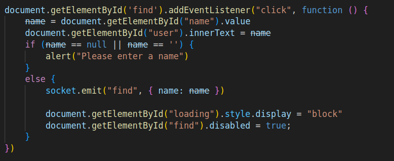
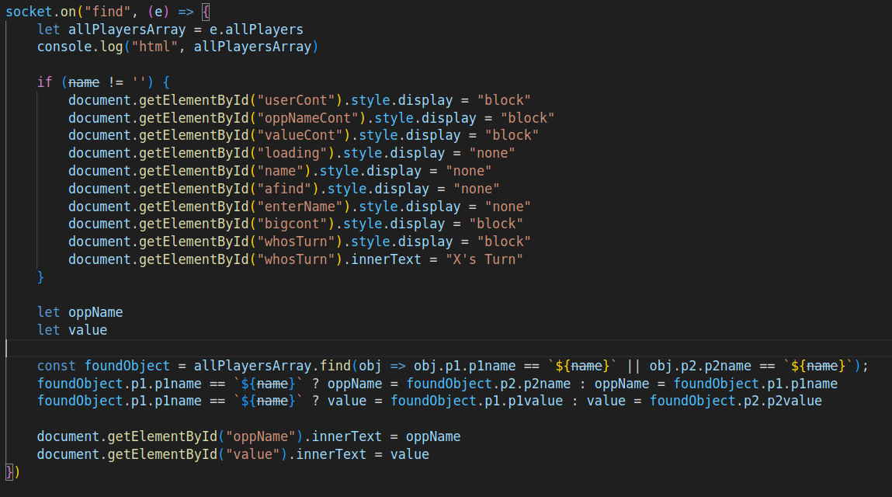
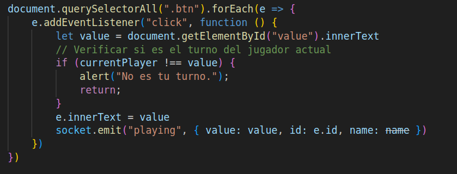
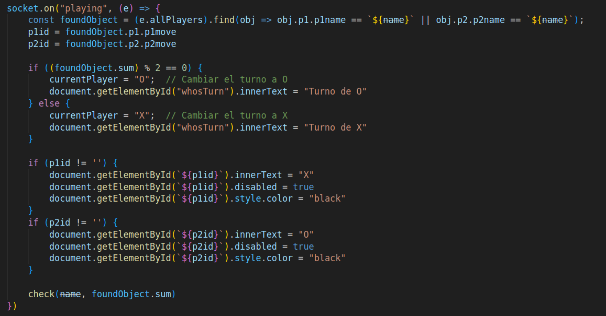
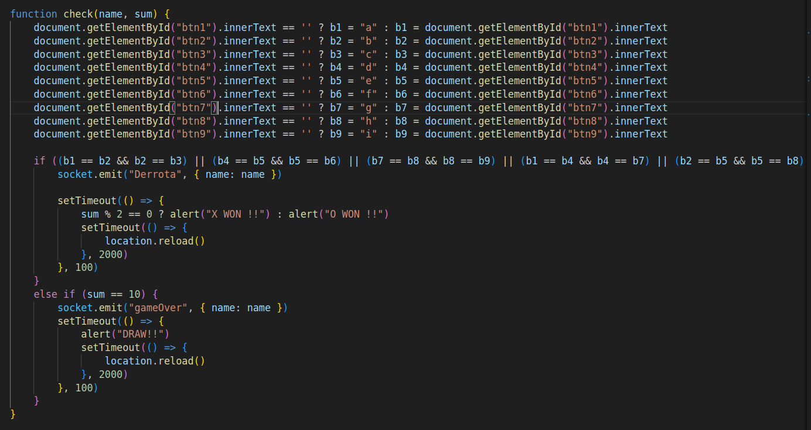

<<<<<<< HEAD
<<<<<<< HEAD
## FEATURE/ API-REST
ESTA RAMA TIENE LAS ÚLTIMAS ACTUALIZACIONES
Esta rama se creó con la finalidad de tener preparado un servidor que atenderá las solicitudes http del proyecto.

## Conexiones
Se conectan los archivos de la siguiente forma

```
index.html <-> game.js <--------
                               |
games.html <-> tool.js <-------|---> app.js
                               |  
stats.html <-> toolStats.js <---
```
-----------------------------------------------------------------------------------------------------------------
#Inicialización
Se creo la rama feature/api-rest a partir de la rama main.

```bash
git checkout -b feature/api-rest
```
#Primera versión de la rama
Se creo un archivo client.js que contenía la logica básica para el juego de tic-tac-toe

En el package.json se hizo un test instalando primero con los siguientes comandos:

```bash
node install express supertest 
```

Primero probamos un pequeño código para dejar listo el server y conectar de manera local.
```bash
app.get('/', (req,res)=>{
	res.send("Juego Tic-Tac-Toe! Empezar a jugar");
})

const port = process.env.PORT || 3000;

app.listen(port, ()=>{
	console.log("Server running on port 3000")
})

module.exports = app;

```
Y una pequeña prueba para ver si todo estaba ok.

Hicimos un `git reset --hard` para resetear todo lo avanzado hasta el first commit, ya que al trabajar sin socket dificultaba la conexión y teníamos que cambiar un poco la lógica de conexión y decidimos incluir una interfaz para hacerlo más interactivo con el usuario.


#Utilizando socket.io, segunda version
```bash
node install socket.io http
```
Creamos dos archivos, un index.html y style.css, se ordenó por carpetas y el app.js se queda fuera de src/ 

#docker
En esta parte agregamos el archivo docker con la configuración para contenerizar el proyecto.

```bash
FROM node:14
WORKDIR /app
COPY package*.json ./
RUN npm install
COPY . .
EXPOSE 3000
CMD ["node", "src/app.js"]
```


=======
# pc1-grupo11


# Game.js
 este código gestiona la búsqueda de un usuario enviando su nombre a través de un socket y proporciona retroalimentación visual al usuario (mostrando una animación de carga y desactivando el botón).





Este código actualiza la interfaz de usuario cuando el servidor responde con la lista de jugadores, muestra información sobre el oponente encontrado, y prepara la interfaz para el juego (como mostrar el turno actual). Es parte de un flujo de un juego multijugador donde dos jugadores están siendo emparejados y se actualiza el estado del juego en función de sus datos.




Este código gestiona la interacción del jugador de Tic-Tac-Toe. Cada vez que un jugador hace clic en una casilla:
1. Verifica si es su turno.
2. Actualiza la casilla del jugador (X u O).
3. Informa al servidor sobre el movimiento hecho, enviando los detalles del turno, como el jugador y la casilla seleccionada.

De esta forma, el juego puede sincronizarse entre los jugadores, permitiendo que el servidor controle el estado y valide los movimientos




Este código maneja el evento playing que se emite por el servidor a través del socket. Cada vez que un jugador realiza un movimiento, el servidor envía información que actualiza la interfaz del juego y el estado del turno. lo que hace es
1. Escucha el evento playing emitido por el servidor para obtener los movimientos realizados por ambos jugadores.
2. Actualiza el tablero visualmente mostrando las "X" y "O" en las casillas correspondientes.
3. Cambia el turno entre los jugadores "X" y "O" y muestra el turno actual en la interfaz.
4. Desactiva las casillas que ya fueron seleccionadas para evitar que se elijan nuevamente.

Esto asegura que el juego se sincronice entre los jugadores y que la interfaz siempre refleje el estado correcto de la partida.




La función check es responsable de verificar si hay un ganador o si el juego ha terminado en empate en una partida de Tic-Tac-Toe. También gestiona la emisión de eventos al servidor en caso de victoria o empate y recarga la página para reiniciar el juego.


>>>>>>> feature/HTML
