# PC1-Grupo11

# WELCOME TO TIC-TAC-TOE PLAY

## Instrucciones para ejecutar el juego

1. Primero debe de clonar el proyecto con el siguiente comando:
    ```bash
    git clone https://github.com/Strangertame74/pc1-grupo11.git
    ```
2. Luego, diríjase a la carpeta principal del proyecto:

    ```bash
    cd tic/tac/toe
    ```

3.  Una vez ahí Use el siguiente comando para construir y ejecutar el proyecto en un contenedor Docker:

    ```yml
    docker-compose up -d
    ```

4. Una vez que los contenedores estén en ejecución, puede acceder al juego visitando en su navegador.  

    Aplicación: http://localhost:4000  

    Prometheus: http://localhost:9090

    Grafana: http://localhost:3000

Verificación de la ejecución (opcional):

5. Una vez ejecutado el comando deberías de ver que los contenedores para la aplicación, Prometheus y Grafana están ejecutándose en sus respectivos puertos. 

- **Ejecución de docker-compose**
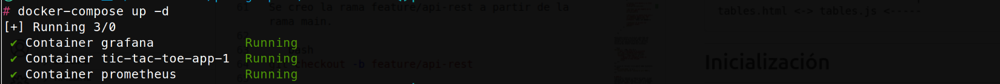

- **Puerto donde se ejecuta el juego**


- **Puerto donde se ejecuta Prometheus**
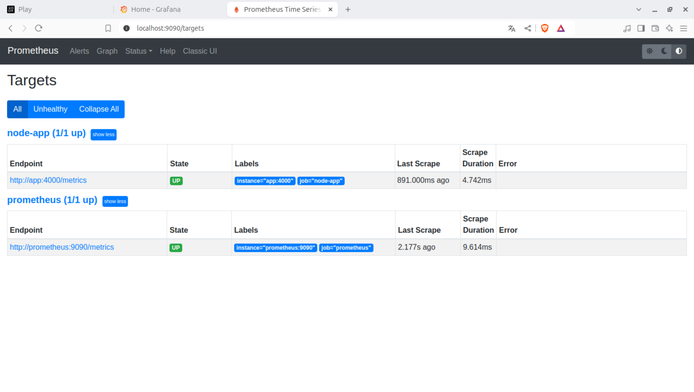

- **Puerto donde se ejecuta Grafana**
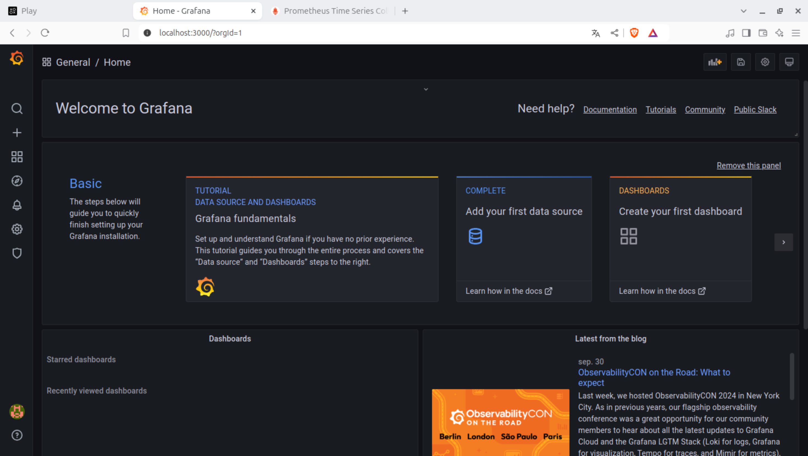

## Funcionalidades del juego y accesos

El sistema ofrece las siguientes funcionalidades adicionales que nos permite monitorear nuestro el estado de nuestro juego y obtener información sobre los jugadores y las partidas activas o finalizadas:

1. **Acceso principal al juego**:  
   Jugar al Tic-Tac-Toe en tiempo real entre dos usuarios:  
   [http://localhost:4000](http://localhost:4000)

2. **Tabla de jugadores**:  
   Muestra una tabla que contiene información sobre los jugadores, incluyendo el número de victorias y puntos acumulados, junto con detalles de las partidas: 
   [http://localhost:4000/tables](http://localhost:4000/tables)
   - Tabla de los jugadores
   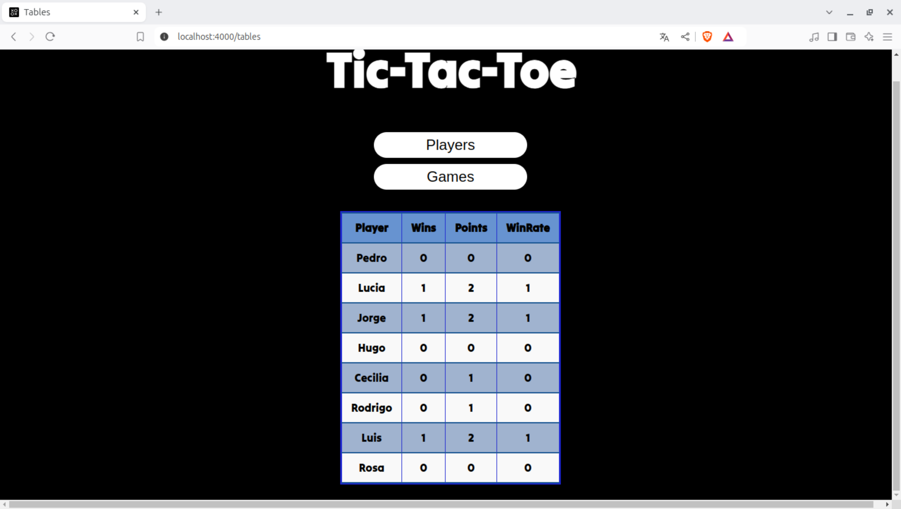
   - Tabla de las partidas
   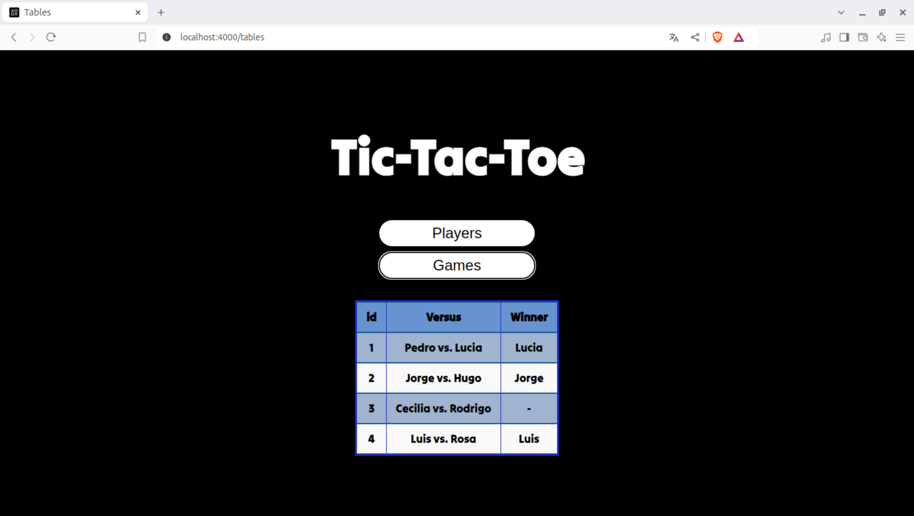

3. **Búsqueda de partidas por ID**:  
   Permite buscar una partida específica ingresando su ID, y muestra información sobre quiénes jugaron y quién ganó:
   [http://localhost:4000/games](http://localhost:4000/games)
   
   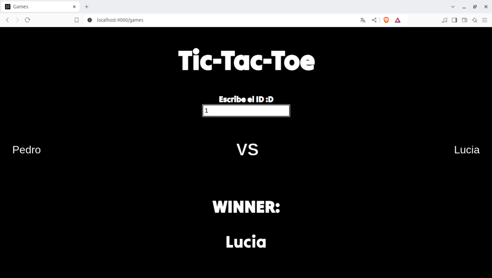
   


## FEATURE/ API-REST
ESTA RAMA TIENE LAS ÚLTIMAS ACTUALIZACIONES
Esta rama se creó con la finalidad de tener preparado un servidor que atenderá las solicitudes http del proyecto.

## Conexiones
Se conectan los archivos de la siguiente forma

```
index.html <-> play.js <--------
                               |
games.html <-> games.js <------|---> app.js
                               |  
tables.html <-> tables.js <-----
```
-----------------------------------------------------------------------------------------------------------------
# Inicialización
Se creo la rama feature/api-rest a partir de la rama main.

```bash
git checkout -b feature/api-rest
```
# Primera versión de la rama
Se creo un archivo client.js que contenía la logica básica para el juego de tic-tac-toe

En el package.json se hizo un test instalando primero con los siguientes comandos:

```bash
node install express supertest 
```

Primero probamos un pequeño código para dejar listo el server y conectar de manera local.
```bash
app.get('/', (req,res)=>{
	res.send("Juego Tic-Tac-Toe! Empezar a jugar");
})

const port = process.env.PORT || 3000;

app.listen(port, ()=>{
	console.log("Server running on port 3000")
})

module.exports = app;

```
Y una pequeña prueba para ver si todo estaba ok.

Hicimos un `git reset --hard` para resetear todo lo avanzado hasta el first commit, ya que al trabajar sin socket dificultaba la conexión y teníamos que cambiar un poco la lógica de conexión y decidimos incluir una interfaz para hacerlo más interactivo con el usuario.


# Utilizando socket.io, segunda version
```bash
node install socket.io http
```
Creamos dos archivos, un index.html y style.css, se ordenó por carpetas y el app.js se queda fuera de src/ 

#docker
En esta parte agregamos el archivo docker con la configuración para contenerizar el proyecto.

```bash
FROM node:14

WORKDIR /app

COPY package*.json ./

RUN npm install

COPY . .

EXPOSE 3000

CMD ["node", "src/app.js"]
```
----------------------------------------------------------------

# Pasos para correr el programa
- Primero clonar el repositorio de git:
    ```bash
    git clone https://github.com/Strangertame74/pc1-grupo11/tree/feature/api-rest
    ```
- Luego dirigirse al directorio donde está el proyecto
    ```bash
    cd pc1-grupo11/tic-tac-toe/src
    ```
- Instalar las dependencias que faltaran:
    ```bash
    npm install
    ```
- Correr el programa:
    ```bash
    node app.js
    ```
- Dirigirse al localhost:4000 donde estará corriendo el juego:
    ```bash
    http://localhost:4000
    ```


# App.js

Este archivo contiene la configuración del servidor, aquí se usan las librerías que nos van a permitir jugar el tic-tac-toe entre dos usuarios que se conectarán a un mismo room.

-------------------------------------------


Usaremos las librerías de express(para crear la aplicación), path (para conectarlo con el html), http (para servidor http), socket.io (para la comuncación en tiempo real).

```bash
    const express = require('express');
    const app = express();
    const path = require('path');
    const http = require('http');
    const { Server } = require('socket.io');
```

Dentro de socket.io al crear una conexión, cada jugador se tomará de forma independiente y toda la lógica que esté dentro de `io.on("conection", (socket)=> {...})` es para manejar la conexión de cada jugador.

El código atiende el evento 'find' cuando un jugador hace click en el botón para buscar otro jugador, aquí por eso se verifica si ya son 2 para guardarlos en un objeto que contendrá información como puntaje, jugadas, etc. Luego el array que los contiene en una posición seguirá agregando a otros 2 jugadores que jugarán una nueva partida con otro ID.
```bash
socket.on("find",(e)=>{
        
        if(e.name!=null){

            //Se ingresa el nombre al array de espera    
            arr.push(e.name)

            //Se añade al emisor del evento a un room 
            socket.join(gameId)
            
            //Cuando hay más de 2 jugadores en la lista de espera
            if(arr.length>=2){

                //Buscamos a los dos jugadores en la lista players
                let ply1 = players.find(obj => obj.name == arr[0])
                let ply2 = players.find(obj => obj.name == arr[1])

                //en caso no se encuentren se crean sus usuarios
                /*
                cada jugador tiene :
                    nombre, cantidad de partidas, victorias y puntos (+1 empate, +2 victoria, 0 derrota)
                */
               //en caso los jugadores existan, se les añade una partida más
                if(!ply1){
                    ply1 = {
                        name: arr[0],
                        games: 1,
                        wins: 0,
                        points: 0
                    }
                    players.push(ply1)
                }
                else{
                    ply1.games++
                }

                if(!ply2){
                    ply2 = {
                        name: arr[1],
                        games: 1,
                        wins: 0,
                        points: 0
                    }
                    players.push(ply2)
                }
                else{
                    ply2.games++
                }

                console.log(players)

                //Aparte se crean los objetos players para que esten internamente en el objeto de partida
                /*
                cada player tiene :
                    nombre, valor de marca, y el movimiento que realiza.
                */

                let p1obj={
                    name:arr[0],
                    value:"X",
                    move:""
                }
                let p2obj={
                    name:arr[1],
                    value:"O",
                    move:""
                }
                
                //Se añade un id a cada juego, los dos players, el campo de ganador y la suma de movimientos realizados
                let obj={
                    id:gameId,
                    p1:p1obj,
                    p2:p2obj,
                    winner:"-",
                    sum:1
                }

                //Añadimos este objeto a la lista de partidas
                playingArray.push(obj)
                
                //Borramos los dos nombres de la lista de espera
                arr.splice(0,2)
                
                //Retornamos el evento find solo a los jugadores dentro del room
                io.to(gameId).emit("find", { allPlayers: [obj], id: gameId })

                //Cambiamos el id para los siguientes juegos
                gameId++
            }
            
        }
        
    })
```

Necesitamos mostrar el archivo index.html que contiene la parte gráfica del juego, esto se configura con una solicitud GET, el servidor enviará como respuesta el archivo .html a la solicitud del browser donde nos conectemos.


```bash
app.get('/', (req, res) => {        
    // Medir la duración de la solicitud
    const end = histogram.startTimer();
    res.sendFile(path.resolve(__dirname, 'frontend', 'index.html'), () => {
        // Detener el cronómetro cuando la respuesta se haya enviado
        end();
    });
});
```
Se inicia el servidor en el puerto 4000 localmente.
```bash
server.listen(4000, () => {
    console.log('Server running on port 4000');
});
```

# Game.js
Este archivo contiene la lógica del juego, lo que comprende los eventos del click, mouse, y eventos personalizados como 'playing', 'find' y finalmente una función `check()` que verificará si el juego terminó.

-------------------------------------------------------------------

 Cuando se hace click en el botón con id 'find', se dispara un evento el cual recoge el nombre en la casilla con id 'name' y se pasa ese nombre a la casilla destinada para el nombre del user.

 Si es que no hay no nombre te sale un aviso, sino, se envía el evento find al archivo app.js, sale el logo cargando y se desactiva el botón. 

```bash
document.getElementById('find').addEventListener("click", function () {
    name = document.getElementById("name").value
    document.getElementById("user").innerText = name 
    if (name == null || name == '') {
        alert("Please enter a name")
    }
    else {
        // Si el nombre es valido se envia el evento find a app.js con el nombre del jugador actual
        socket.emit("find", { name: name })

        document.getElementById("loading").style.display = "block";
        document.getElementById("find").style.display= "none";
    }
})
```


Cuando se dispara el evento 'find' al presionar el botón de búsqueda de jugadores, va a verificar que los nombres tengan algún texto y de acuerdo a ello va a mostrar el 'boardgame' que es el tablero del juego, y se va a ocultar la parte de los nombres y el botón de búsqueda de jugadores.
Luego va a añadir el nombre de cada jugador a las variables que luego también se mostrarán para ver quiénes se enfrentan.

```bash
socket.on("find", (e) => {
    /*
    El evento find alista visualmente toda la pagina 
    con logica JS, el nombre del jugador y del oponente
    e internanemente cambia el currentId al de la partida
    */
    let allPlayersArray = e.allPlayers
    console.log("html", allPlayersArray)

    currentId = e.id;

    if (name != '') {
        document.getElementById("main").style.display = "none";
        document.getElementById("boardgame").style.display= "block";
    }

    let oppName
    let value

    const foundObject = allPlayersArray.find(obj => obj.p1.name == `${name}` || obj.p2.name == `${name}`);
    foundObject.p1.name == `${name}` ? oppName = foundObject.p2.name : oppName = foundObject.p1.name
    foundObject.p1.name == `${name}` ? value = foundObject.p1.value : value = foundObject.p2.value

    document.getElementById("oppName").innerText = oppName
    document.getElementById("value").innerText = value
})

```

Para los turnos, al hacer click en un botón:
1. Verifica si es su turno.
2. Actualiza la casilla del jugador (X u O).
3. Informa al servidor sobre el movimiento hecho, enviando los detalles del turno, como el jugador y la casilla seleccionada.

De esta forma, el juego puede sincronizarse entre los jugadores, permitiendo que el servidor controle el estado y valide los movimientos

```bash
document.querySelectorAll(".btn").forEach(e => {
    e.addEventListener("click", function () {

        let value = document.getElementById("value").innerText
        // Verificar si es el turno del jugador actual
        if (currentPlayer !== value) {
            alert("No es tu turno.");
            return;
        }
        e.innerText = value
        // En caso sea un turno valido emitimos el evento playing a app.js
        // Envia el valor de juego actual, el id del boton seleccionado, el nombre del jugador y el id de la partida
        socket.emit("playing", { value: value, id: e.id, name: name, idGame: currentId })
    })
});

```

En esta parte manejamos el evento 'playin' que se manda cuando se hace click a un botón.
Aquí simplmenete vemos que si sum es par le toca a X y si no, le toca a O, y de acuerdo a eso se pondrá en el lugar que se ha hecho click uno de los dos valores.

Por último se verifica con la función check el estado del juego.

```bash
socket.on("playing", (e) => {
    //Encuentra del objeto de la partida por su id
    const foundObject = (e.allPlayers).find(obj => currentId == obj.id && (obj.p1.name == `${name}` || obj.p2.name == `${name}`));

    //Toma los movimientos de ambos jugadores
    p1id = foundObject.p1.move
    p2id = foundObject.p2.move

    //El turno se determina por si la cantidad de movimientos hechos es par o impar
    if ((foundObject.sum) % 2 == 0) {
        currentPlayer = "O";  // Cambiar el turno a O
        document.getElementById("whosTurn").innerText = "Turno de O"
    } else {
        currentPlayer = "X";  // Cambiar el turno a X
        document.getElementById("whosTurn").innerText = "Turno de X"
    }

    //Pone visualmente a los botones el valor que se le ha asignado
    if (p1id != '') {
        document.getElementById(`${p1id}`).innerText = "X"
        document.getElementById(`${p1id}`).disabled = true
        document.getElementById(`${p1id}`).style.color = "black"
    }
    if (p2id != '') {
        document.getElementById(`${p2id}`).innerText = "O"
        document.getElementById(`${p2id}`).disabled = true
        document.getElementById(`${p2id}`).style.color = "black"
    }

    //Checekamos el estado de la partida
    check(name, foundObject.sum, foundObject)
})
```

En la función check como mencionamos simplemente se verifica si es que cumple alguno de los casos donde uno de los dos gana y se emite una alerta anunciando quén ganó, o en todo caso si la suma es 10 significa que terminó el juego en empate.

```bash
function check(name, sum, foundObject) {
    //Asiganmos las variables bi, que representan a cada boton
    //Si un boton no ha sido clickeado le toca una letra
    document.getElementById("btn1").innerText == '' ? b1 = "a" : b1 = document.getElementById("btn1").innerText
    document.getElementById("btn2").innerText == '' ? b2 = "b" : b2 = document.getElementById("btn2").innerText
    document.getElementById("btn3").innerText == '' ? b3 = "c" : b3 = document.getElementById("btn3").innerText
    document.getElementById("btn4").innerText == '' ? b4 = "d" : b4 = document.getElementById("btn4").innerText
    document.getElementById("btn5").innerText == '' ? b5 = "e" : b5 = document.getElementById("btn5").innerText
    document.getElementById("btn6").innerText == '' ? b6 = "f" : b6 = document.getElementById("btn6").innerText
    document.getElementById("btn7").innerText == '' ? b7 = "g" : b7 = document.getElementById("btn7").innerText
    document.getElementById("btn8").innerText == '' ? b8 = "h" : b8 = document.getElementById("btn8").innerText
    document.getElementById("btn9").innerText == '' ? b9 = "i" : b9 = document.getElementById("btn9").innerText

    if ((b1 == b2 && b2 == b3) || (b4 == b5 && b5 == b6) || (b7 == b8 && b8 == b9) || (b1 == b4 && b4 == b7) || (b2 == b5 && b5 == b8) || (b3 == b6 && b6 == b9) || (b1 == b5 && b5 == b9) || (b3 == b5 && b5 == b7)) {
        socket.emit("Derrota", { name: name })

    //Combinaciones para victoria
    if ((b1 == b2 && b2 == b3) || (b4 == b5 && b5 == b6) || (b7 == b8 && b8 == b9) || (b1 == b4 && b4 == b7) || (b2 == b5 && b5 == b8) || (b3 == b6 && b6 == b9) || (b1 == b5 && b5 == b9) || (b3 == b5 && b5 == b7)) {
        //En caso haya victoria, retornamos el current player a X
        currentPlayer = "X"
        //Segun el turno verificamos quien era el ganador
        sum % 2 == 0 ? winner = foundObject.p1.name : winner = foundObject.p2.name
        //Emitimos el evento juego terminado a app.js
        //Enviamos el jugador presente, el ganador y el id de la partida
        socket.emit("gameOver", { name: name, winner: winner, id:foundObject.id  })

        //Emitimos una alerta y recargamos la pagina
        setTimeout(() => {
            sum % 2 == 0 ? alert("X WON !!") : alert("O WON !!")
            setTimeout(() => {
                location.reload()
            }, 2000)
        }, 100)
    }
    //Con 10 clicks ya la partida queda en empate
    else if (sum == 10) {
        //En caso haya victoria, retornamos el current player a X
        currentPlayer = "X"
        //Emitimos el evento juego terminado a app.js
        //Enviamos el jugador presente, el ganador y el id de la partida
        socket.emit("gameOver", { name: name, winner: winner, id:foundObject.id })
        //Emitimos una alerta y recargamos la pagina
        setTimeout(() => {
            alert("Empate!!")
            setTimeout(() => {
                location.reload()
            }, 2000)
        }, 100)
    }
}}
```


## feature/configurar-prometheus

## totalHttpRequestDuration

La métrica totalHttpRequestCount se incrementa cada vez que se recibe una 
solicitud HTTP. Esto se implementa en el middleware que mide las solicitudes, 
donde se registra la cantidad total de solicitudes.

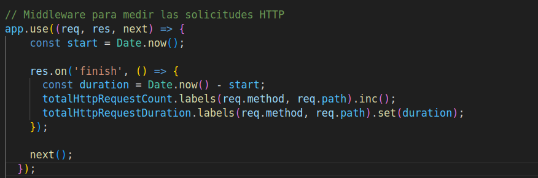

Este bloque de código define una métrica de tipo Gauge que se utiliza para 
medir la duración de las solicitudes HTTP manejadas por la aplicación.


## Partidas activas
Esta parte del código define una métrica de tipo Gauge que es utilizada para 
rastrear el número de partidas activas en el sistema


La métrica partidasActivas se incrementa al iniciar una nueva partida en el 
juego de Tic-Tac-Toe, lo que permite a Prometheus monitorear el número actual 
de partidas activas
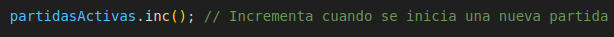

## puntuacionJugador

La métrica tic_tac_toe_player_score es un Gauge que mide las puntuaciones de los 
jugadores en el juego de Tic-Tac-Toe, definida con la librería prom-client. 
Se actualiza al final de cada partida cuando un jugador gana, incrementando 
su puntuación. Esta métrica se expone a través del endpoint /metrics, permitiendo 
a Prometheus recolectar los datos. En Grafana, se puede visualizar para analizar 
el rendimiento de los jugadores a lo largo del tiempo

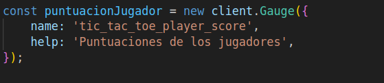

En este bloque de código, se decrementa la métrica partidasActivas al finalizar 
una partida, lo que permite un seguimiento preciso de las partidas activas en 
el juego. Además, se incrementa la puntuación del jugador correspondiente, 
registrando así el rendimiento del jugador en el sistema.

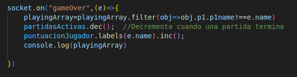

# Grafana


## Monitoreo de Partidas Activas
La gráfica muestra el número de partidas activas en tiempo real. Cada vez que se inicia una nueva partida, el valor de partidasActivas se incrementa, y cuando una partida finaliza, este valor se reduce. Esto permite un monitoreo continuo de las partidas activas en el sistema.

```shell
partidasActivas.inc();  // Incrementa cuando se inicia una partida
partidasActivas.dec();  // Decrementa cuando una partida termina

```
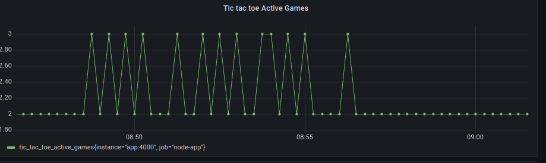

## Puntuacion de los jugadores
La gráfica refleja la métrica de puntuación de los jugadores en el juego Tic-Tac-Toe, mostrando cómo sus puntuaciones cambia a medida que avanza el juego

```sehll
puntuacionJugador.labels(e.name).inc();  // Incrementa la puntuación del jugador 
```

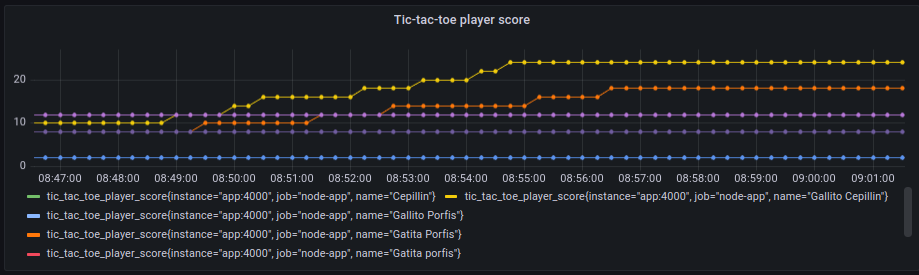

## Latencia de API
La latencia de la API se evalua mediante un histograma de Prometheus, el cual monitorea y registra la duración de cada solicitud HTTP. Esta métrica proporciona información valiosa sobre el tiempo de respuesta de la API, permitiendo realizar un análisis detallado del rendimiento de la aplicación.

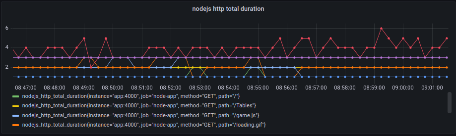

