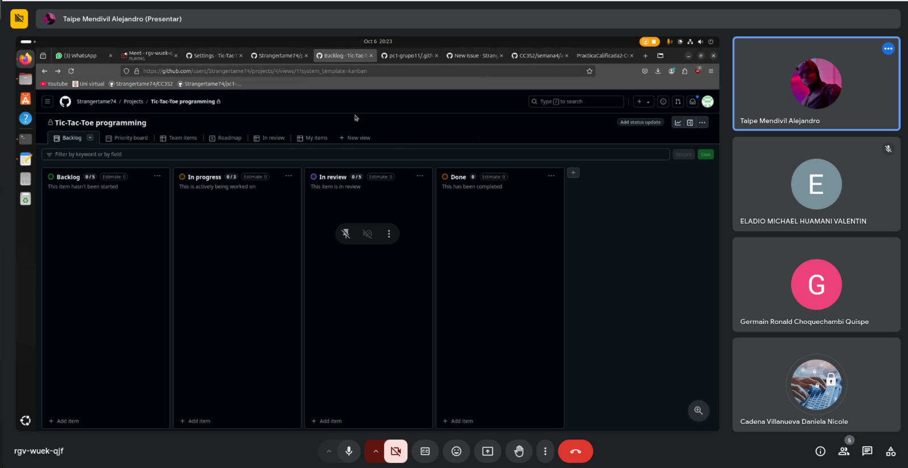
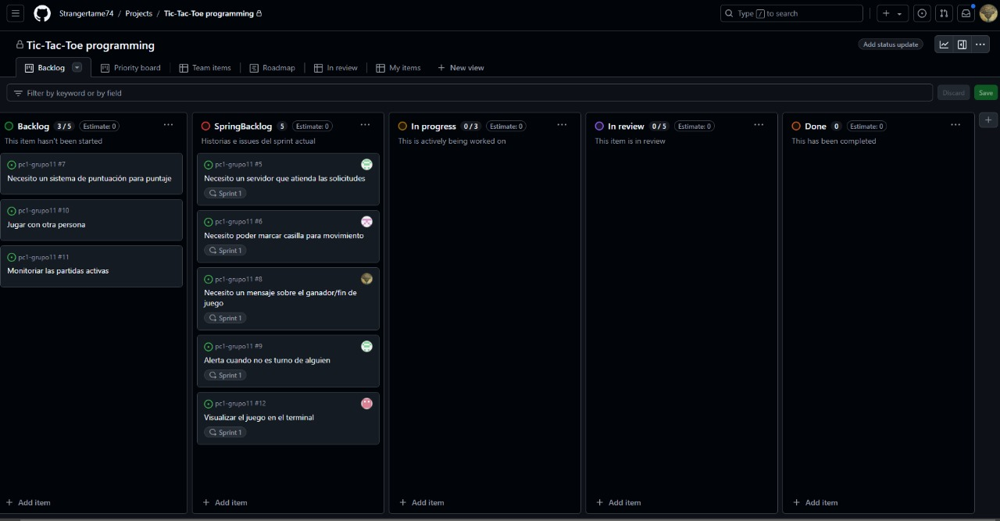
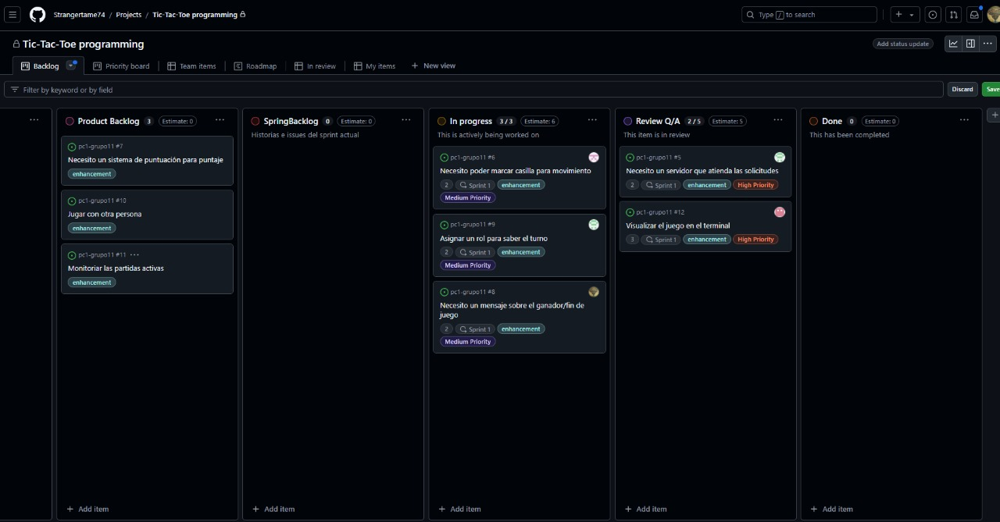
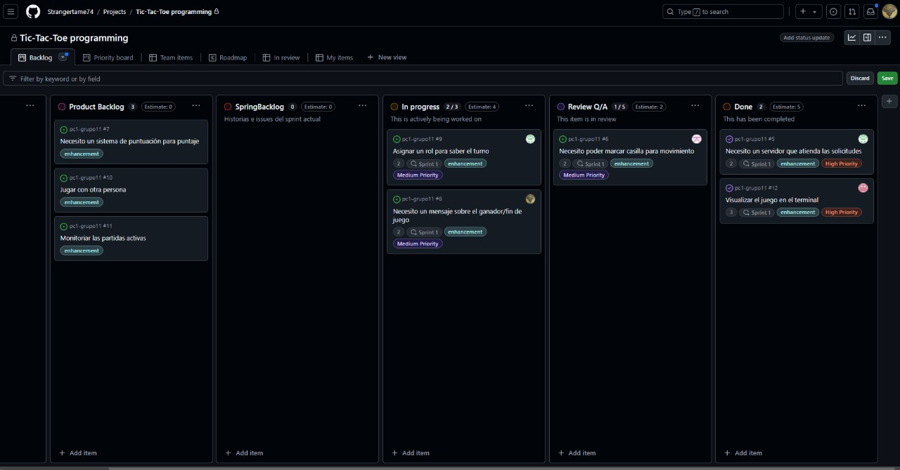
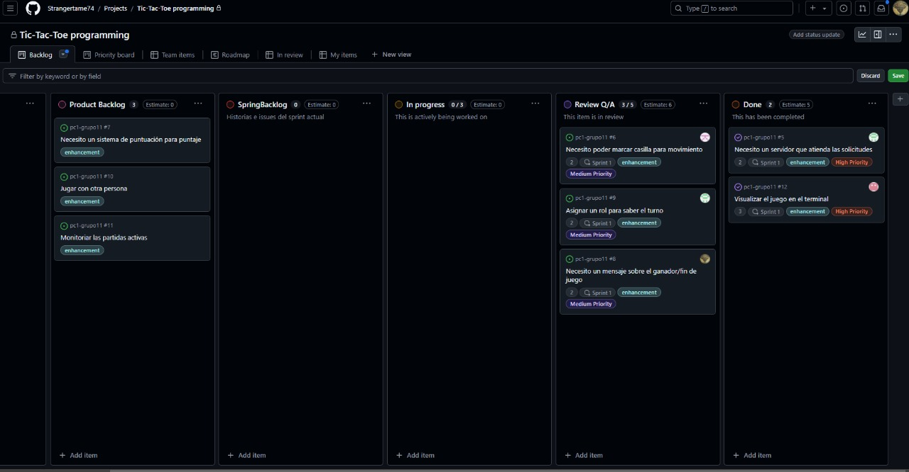
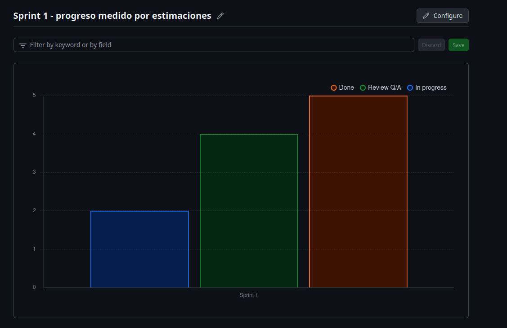
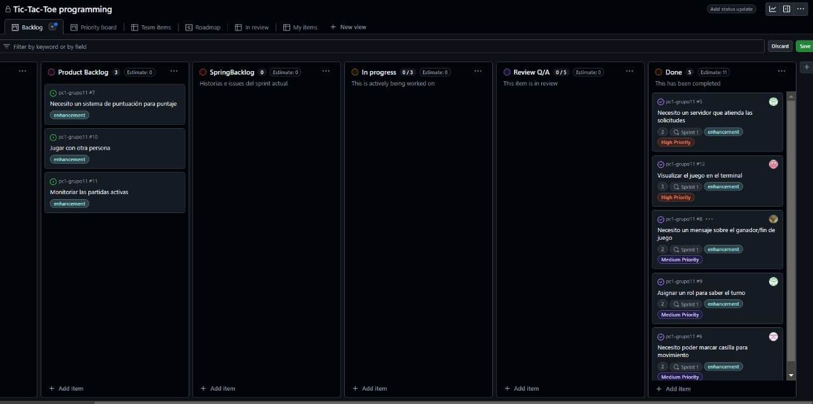
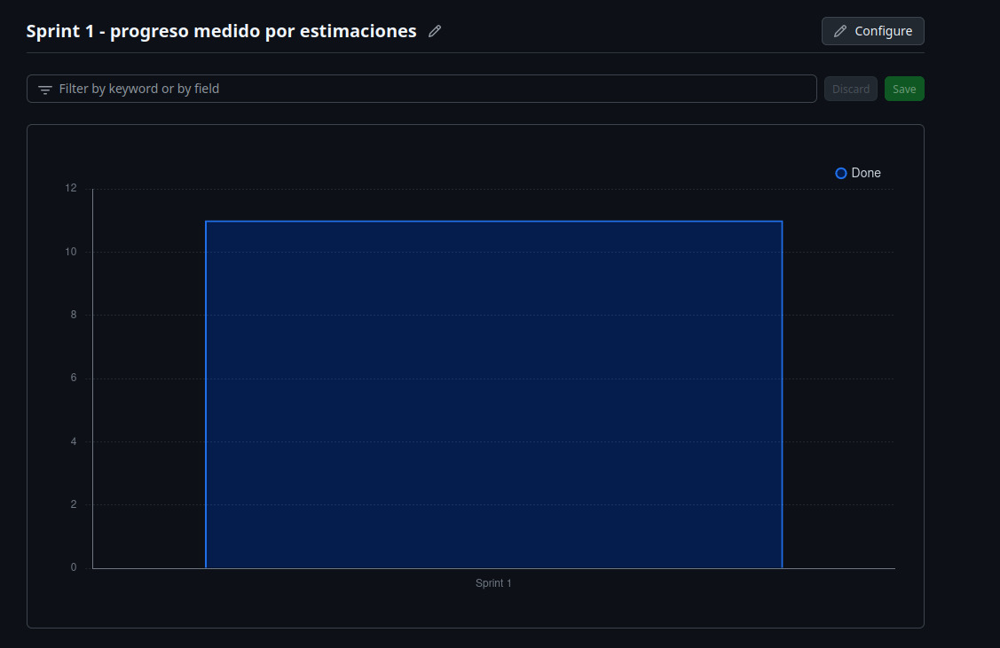

# Sprint 1

El objetivo de este sprint es establecer la base para el 
para el desarrollo del proyecto mediante la configuración del tablero Kanban
la creación del Product Backlog, la reescritura de historias de usuario con 
criterios de aceptación, la implementación de funcionalidades básicas

1. Con el equipo del proyecto se hizo la primera reunion, donde se vio los diferentes puntos de trabajo, se discutieron los diferentes puntos de trabajo y se asignaron las responsabilidades entre los miembros del equipo. El enfoque estuvo en coordinar las tareas clave del sprint y alinear las expectativas para el desarrollo.

- Crear un Servidor
- Marcar casilla para jugar
- Visualizar el juego en el terminal
- Verificar ganador/empate
- Verificar/respetar turno

Para la organización y seguimiento del sprint, hemos utilizado un tablero Kanban que
nos ha permitido visualizar el progreso de las tareas de manera clara y eficiente. +

se completaron 3 tareas clave y 2 están en revisión, incluyendo la 
implementación del sistema de turnos y la visualización del juego en el 
terminal. Las tareas en progreso, como el sistema de puntuación y el juego 
multijugador, avanzan según lo planeado.

Se ha completado la implementación de un servidor que maneja y atiende las solicitudes del juego, garantizando la comunicación entre los jugadores. Además, se ha desarrollado la funcionalidad que permite visualizar el estado del juego en el terminal, proporcionando una interfaz sencilla para la interacción del usuario.

## Grafica Proceso medido por estimaciones

La gráfica del Sprint 1 muestra que se han completado 5 tareas (Done), 4 están en revisión (Review Q/A) y 2 se encuentran en desarrollo (In Progress). Esta representación ayuda a monitorear el progreso del equipo y a identificar áreas que requieren atención.

La siguiente gráfica representa el progreso del Sprint 1, medido por estimaciones, específicamente para las tareas que han sido completadas
En esta gráfica, la barra indica que se han completado las tareas estimado para el sprint.

